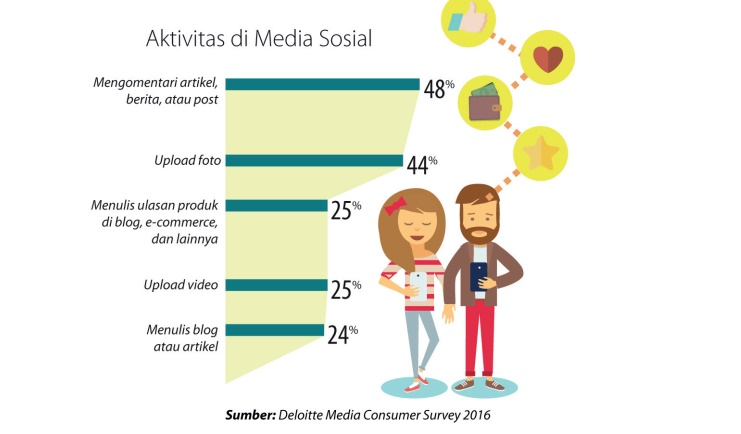

# Assignment 3 HCI

## TEAM M
1. Andira Azzahra (1313619006)
2. Cicely Patricia Sinaulan (1313619007)
3. I Gede Eka Pahlguna (1313619029)

## PROLOG
Di zaman sekarang yaitu zaman  yang serba digital menggunakan media sosial  setiap hari adalah suatu kebutuhan bagi banyak orang.
semakin pesatnya penggunaan media sosial dan semakin canggihnya teknologi, memberikan kontribusi yang nyata terhadap makin 
mudahnya penyebaran tentang berbagai hal di media sosial salah satu contohnya adalah tentang istilah-istilah yang mereka gunakan. 
istilah atau kata-kata adalah hal yang berperan penting di media sosial, dengan istilah dan kata-kata, kita dapat berkomunikasi dan 
beraktivitas di media sosial. Namun sayangnya, banyak sekali pengguna media sosial yang kerap salah dalam menngunakan istilah 
di media sosial dan terlalu cepat menarik kesimpulan dalam mengartikan istilah-istilah tersebut.

