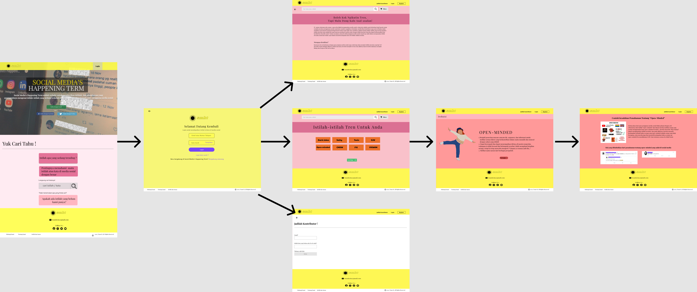

# ASSIGNMENT 3 HUMAN COMPUTER INTERACTION (HCI)

## TEAM M
1. Andira Azzahra (1313619006) as baabyygalll
2. Cicely Patricia Sinaulan (1313619007) as team-M-ilkomunj2019
3. I Gede Eka Pahlguna (1313619029)

## First Phase Requirement Gathering
Social Media's Happening Term merupakan aplikasi berbasis web yang dibuat untuk para pengguna media sosial yang sekadar "ikut-ikutan" menggunakan istilah asing
yang sedang tren di media sosial tanpa mengetahui makna sebenarnya dari istilah asing tersebut. Dengan itu kami membuat kuesioner yang kami bagikan kepada lebih dari 50 orang yang rentang umurnya 15-30 tahun, yaitu orang-orang yang aktif mengikuti tren di media sosial, untuk mengumpulkan data-data mengenai kebutuhan dan fitur yang mereka harapkan pada web Social Media's Happening Term ini. Di bawah ini adalah hasil kuesioner pertama berupa hasil dari grafik dari google form dan data yang disajikan melalui Microsoft Excel.

<a href="https://github.com/team-M-Ilkomunj2019/HCI-Web-App/tree/main/Hasil_Kuesioner">→ Klik di sini untuk melihat grafik hasil kuesioner 1</a>

<a href="https://github.com/team-M-Ilkomunj2019/HCI-Web-App/blob/main/Kuesioner%20Web%20App%20_%20Social%20Media's%20Happening%20Term.csv.zip">→ Klik di sini untuk melihat hasil data kuesioner 1 dalam bentuk excel/table</a>

<a href="https://github.com/team-M-Ilkomunj2019/HCI-Web-App/blob/main/Mini-Report-1st-DataGathering.pdf">→ Klik di sini untuk melihat mini report first data gathering</a>

## Portofolio
Pembuatan Web Social Media's Happening Term ini bertujuan untuk memberikan pemahaman yang benar tentang istilah-sitilah asing yang kerap digunakan masyarakat indonesia
dalam bermedia sosial agar menciptakan kenyamanan antar pengguna media sosial. Setelah membagikan kuesioner dan menobservasinya, kami mendapatkan beberapa kesimpulan
tentang keinginan user untuk fitur di  web Social Media's Happening Term ini sehingga web tersebut menarik dan berguna untuk dikunjungi.

<h3>Fitur Tidak Login</h3>

○ Langsung melihat istilah asing yang tersedia di website

○ Menggunakan fitur filter untuk mengurutkan kata sesuai yang Anda inginkan berdasarkan pilihan yang tersedia

○ Mencari kata asing yang ingin anda ketahui maknanya

○ Jika tidak terdapat kata asing yang Anda cari, masukin kata ke box "jadilah kontributor"

<h3>Fitur Login</h3>

○ Daftar dengan email, Facebook atau Twitter

○ Masuk menggunakan email dan password

○ Langsung melihat istilah asing yang tersedia di website

○ Menggunakan fitur filter untuk mengurutkan kata sesuai yang Anda inginkan berdasarkan pilihan yang tersedia

○ Mencari kata asing yang ingin anda ketahui maknanya

○ Jika tidak terdapat kata asing yang Anda cari, masukin kata ke box "jadilah kontributor"

○ Men-Share kata asing yang ingin Anda share ke berbagai platform yang tersedia

○ Menambahkan kata asing menjadi favorit supaya dapat tersimpan ke fitur "favorit saya"

○ Menggunakan fitur pemberitahuan untuk mendapatkan update data dari web kami 

## Design

<h3> Activity Diagram </h3>

<h3>Interaction Control dengan Login</h3>

<h3>Interaction Control Tanpa Login</h3>

<h3>Mock Up Design Web Social Media's Happening Term</h3>

<a href="https://github.com/team-M-Ilkomunj2019/HCI-Web-App/blob/main/tampilan%20web%20tugas%203/README.md">→ Klik di sini untuk melihat mock up desain web</a>

  
## Second Phase Requirement Gathering
Setelah kami selesai membuat desain berdasarkan keinginan user di kuesioner pertama dan mengobservasinya, kami mengundang para user yang telah mengisi kuesioner pertama 
melalui email untuk menghadiri pertemuan yang membahas desain dan fitur dari web kami pada hari senin, 16 November 2020 jam 20.00 WIB. Kami menjelaskan secara rinci alur
interaksi web kami dan fitur-fitur yang tersedia dan diakhir pertemuan kami meminta masukan secara langsung dalam pertemuan tersebut dengan membuka sesi tanya jawab dan selanjutnya kami memberikan kuesioner kedua untuk memastikan apakah desain dan fitur-fitur yang telah kami buat sesuai dengan kebutuhan user.

<a href="https://youtu.be/LtsBEKClP-M">→ Klik di sini untuk melihat rekaman pertemuan yang membahas desain dan fitur web kami</a>

## Report Writing
Setelah melakukan metode penelitian dengan melalui 3 tahapan di atas, kami membuat sebuah report writing yang menyimpulkan semua yang telah kami lakukan dan amati dalam proses sampai final perancangan web Social Media's Happening Term. 

<a href="https://github.com/team-M-Ilkomunj2019/HCI-Web-App/blob/main/Final-Report-Team-M.pdf">→ Klik di sini untuk melihat report writting</a>

