# Assignment 3 HCI

## TEAM M
1. Andira Azzahra (1313619006)
2. Cicely Patricia Sinaulan (1313619007)
3. I Gede Eka Pahlguna (1313619029)

## PROLOG
Di zaman sekarang yaitu zaman  yang serba digital menggunakan media sosial  setiap hari adalah suatu kebutuhan bagi banyak orang.
semakin pesatnya penggunaan media sosial dan semakin canggihnya teknologi, memberikan kontribusi yang nyata terhadap makin 
mudahnya penyebaran tentang berbagai hal di media sosial salah satu contohnya adalah tentang istilah-istilah yang mereka gunakan. 
istilah atau kata-kata adalah hal yang berperan penting di media sosial, dengan istilah dan kata-kata, kita dapat berkomunikasi dan 
beraktivitas di media sosial. Namun sayangnya, banyak sekali pengguna media sosial yang kerap salah dalam menngunakan istilah 
di media sosial dan terlalu cepat menarik kesimpulan dalam mengartikan istilah-istilah tersebut.

  
  
<h3> Contoh Istilah Asing dan Kesalahan Pemahaman Arti dari Istilah Tersebut </h3>

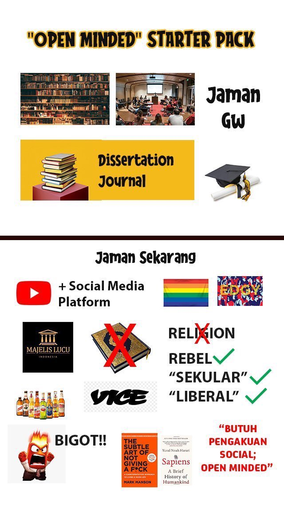

<h3> Salah satu contoh penggunaan kata "open-minded" yang salah </h3>

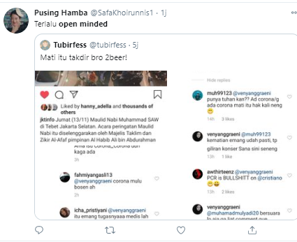

<h3> Mengapa demikian? </h3>
fenomena ini erat kaitannya dengan para penguna media sosial yang cenderung suka memakai istilah atau kata yang lagi “in”
di media sosial sehingga akhirnya istilah atau kata ytersebut menjadi overuse dan akhirnya kata tersebut maknanya menjadi
hilang atau bergeser dari arti awalnya.

<h2> Memperkenalkan Social Media's Happening Term <h2>

Social Media’s Happening Term adalah website untuk memberikan definisi  dan pemahaman yang sesungguhnya mengenai istilah-istilah
yang sedang terkenal atau sering digunakan kepada para pengguna media sosial yang sering kali menyalah artikan sebuah kata ataupun 
istilah sehingga kata atau istilah tersebut kehilangan makna yang sesungguhnya dan disalahgunakan. 
  
  
## HASIL ANALISIS KUESIONER

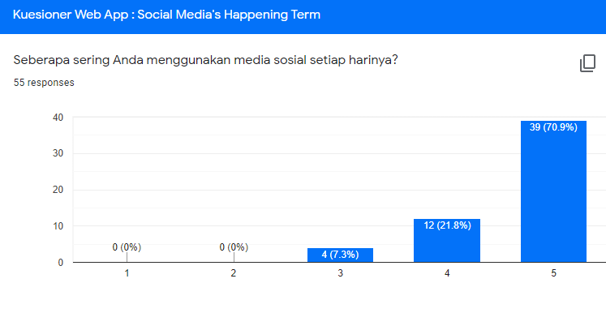

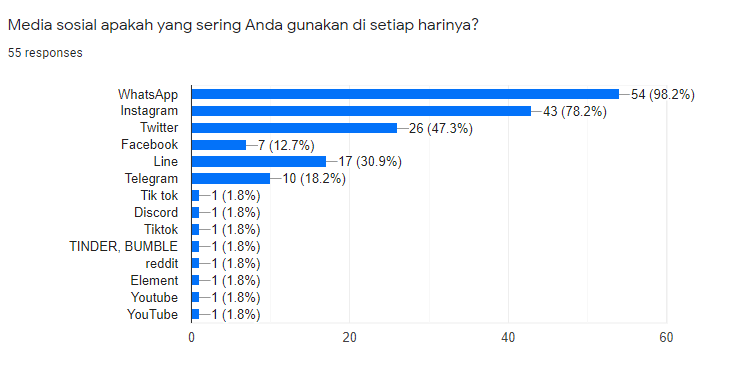

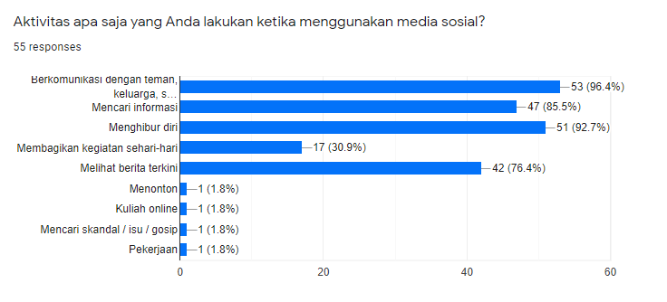

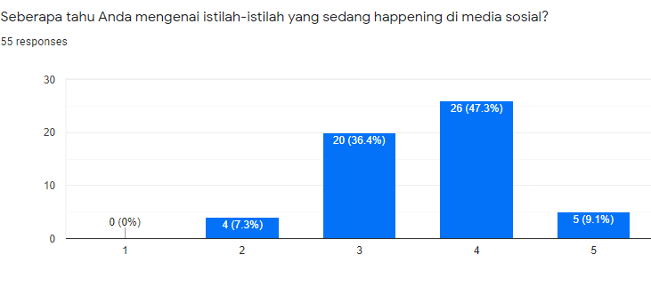

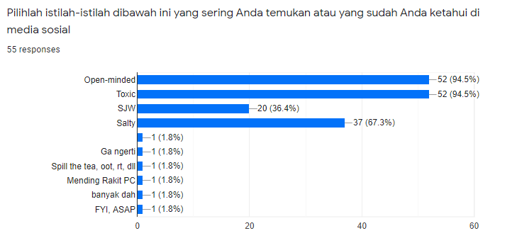

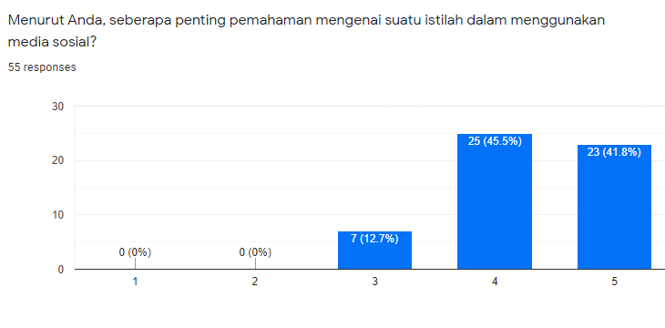 

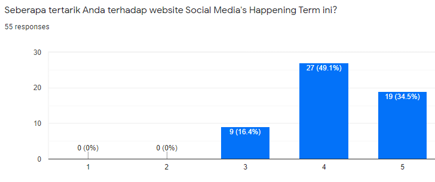

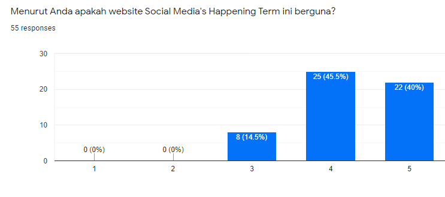

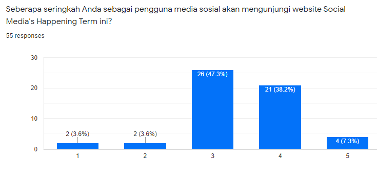

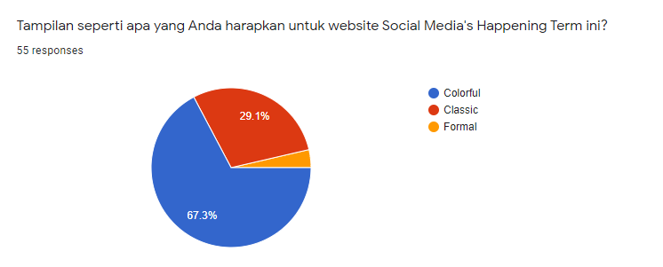

