## MOCK UP WEB
### 1. TAMPILAN DEPAN

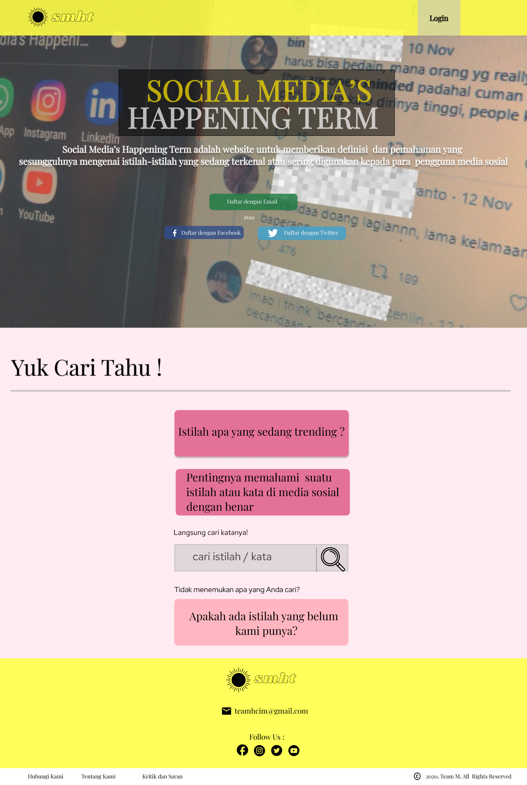

### 2. DAFTAR EMAIL

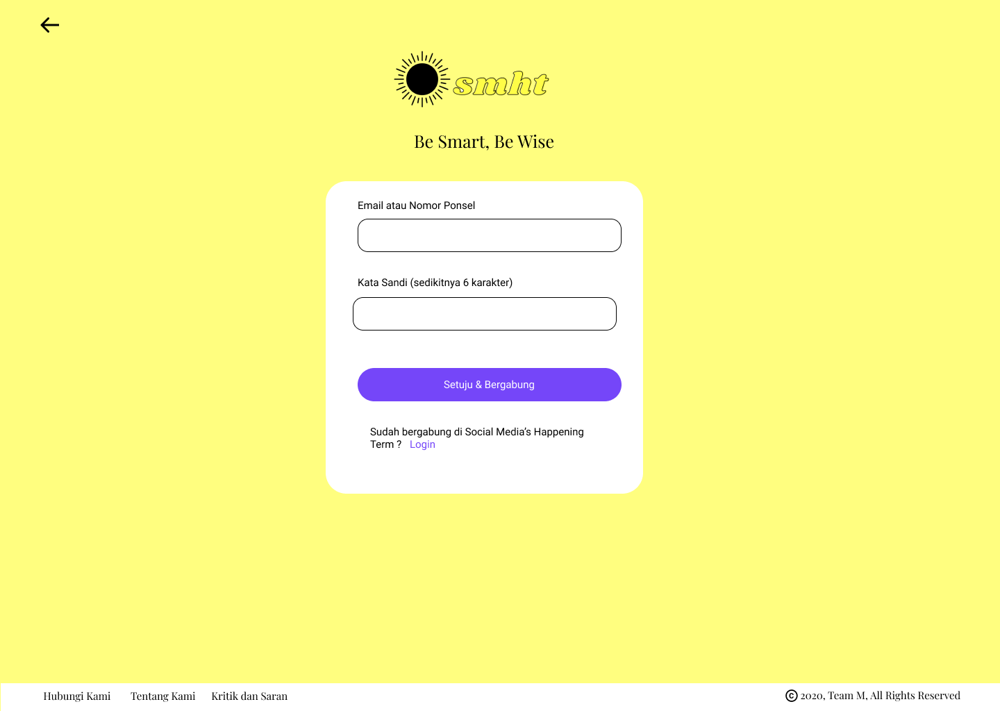

### 3. DAFTAR DENGAN FACEBOOK

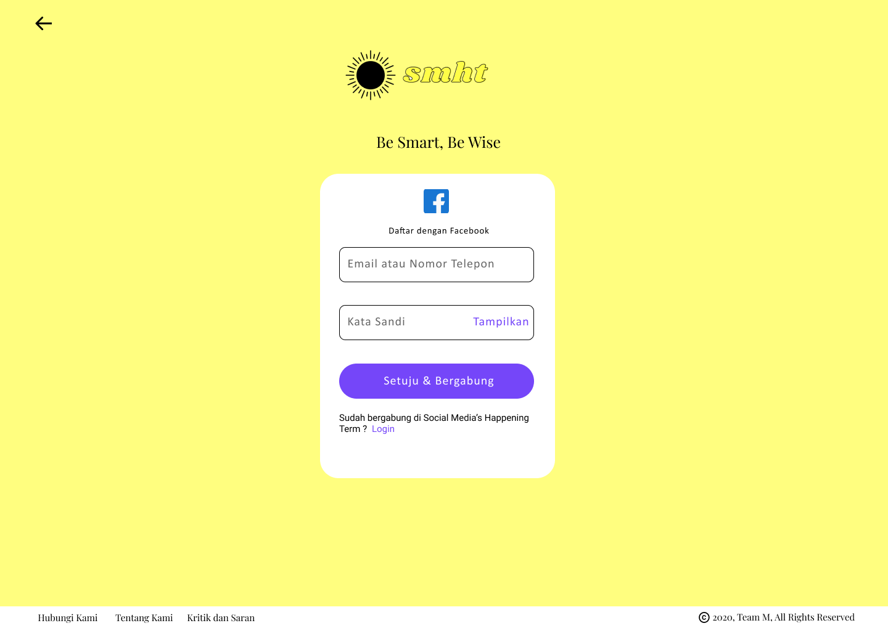

### 4. DAFTAR DENGAN TWITTER

### 5. LOGIN

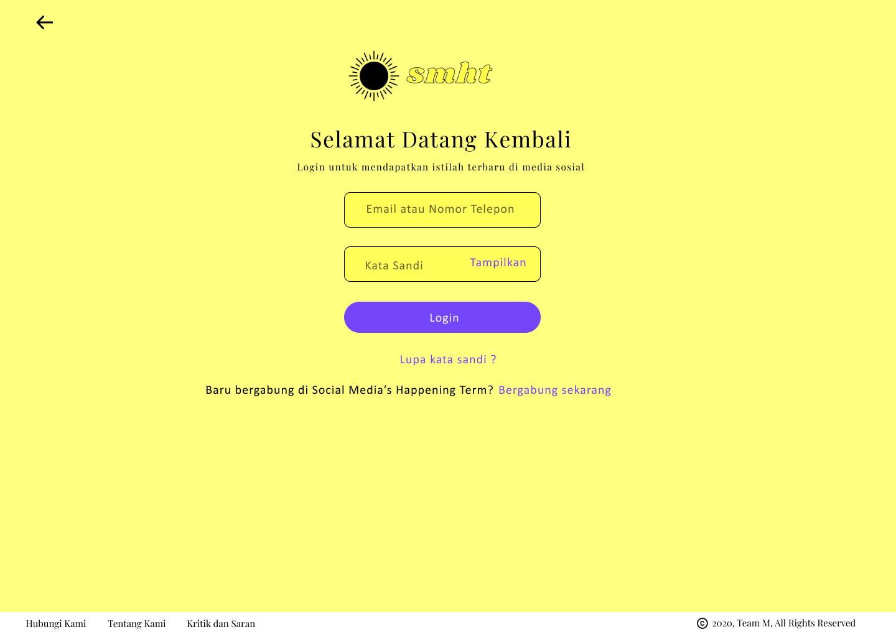

### 6. FITUR PENTINGNYA ISTILAH

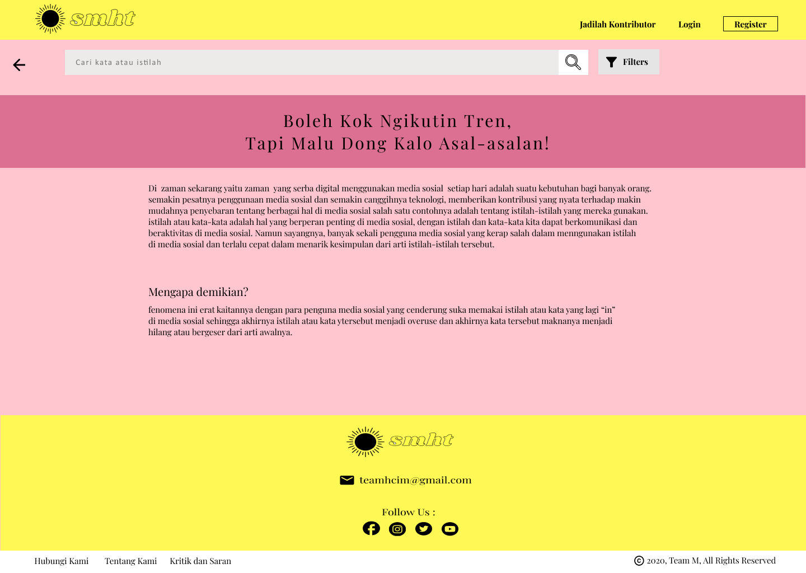

### 7. FITUR JADILAH KONTRIBUTOR

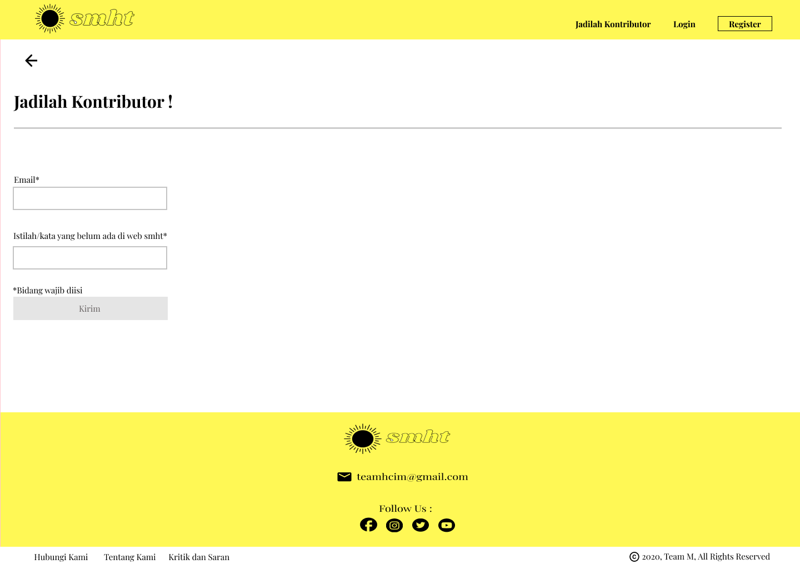

### 8. ISTILAH-ISTILAH ASING

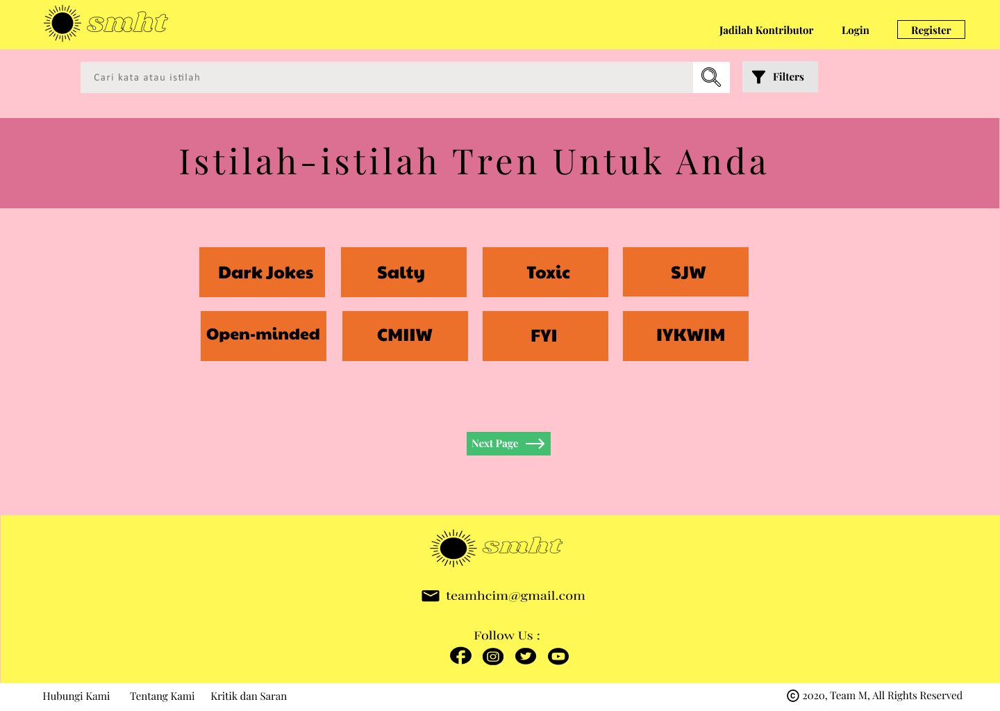

### 9. FITUR FILTER

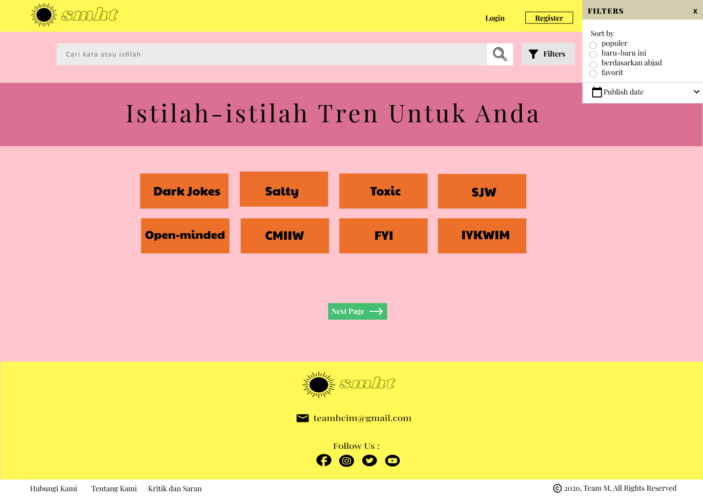

### 10. "OPEN-MINDED"

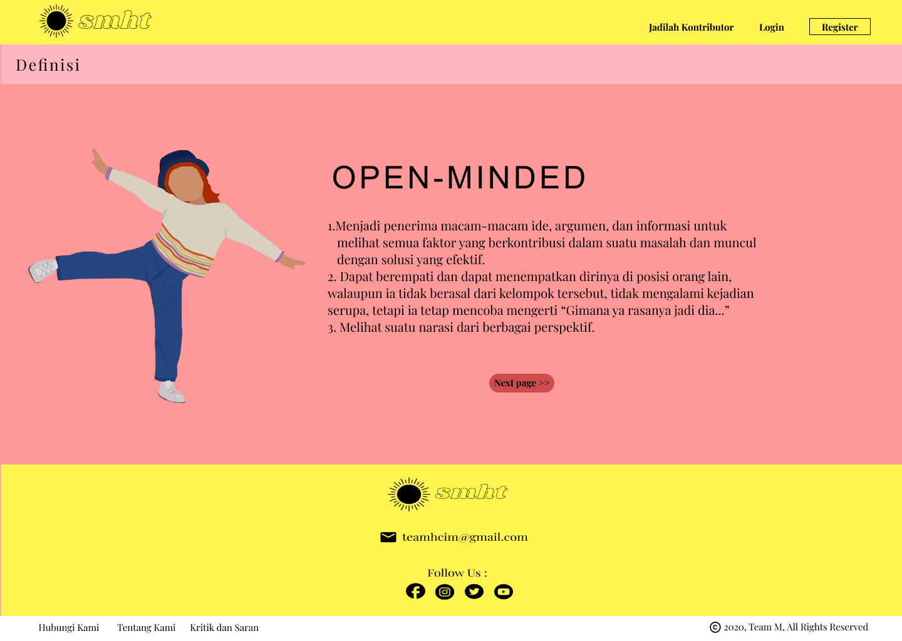

### 11. NEXT PAGE "OPEN-MINDED"

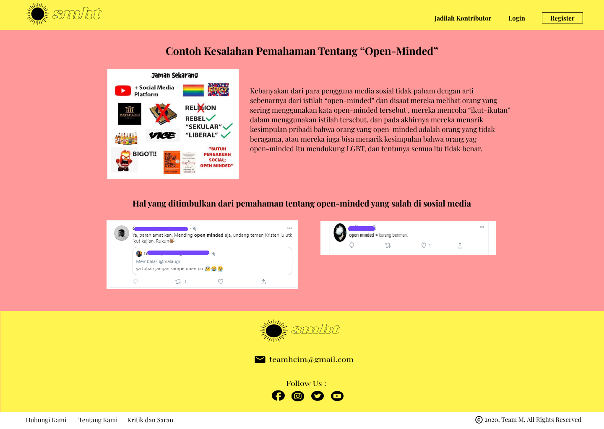

### 12. TAMPILAN JIKA LOGIN

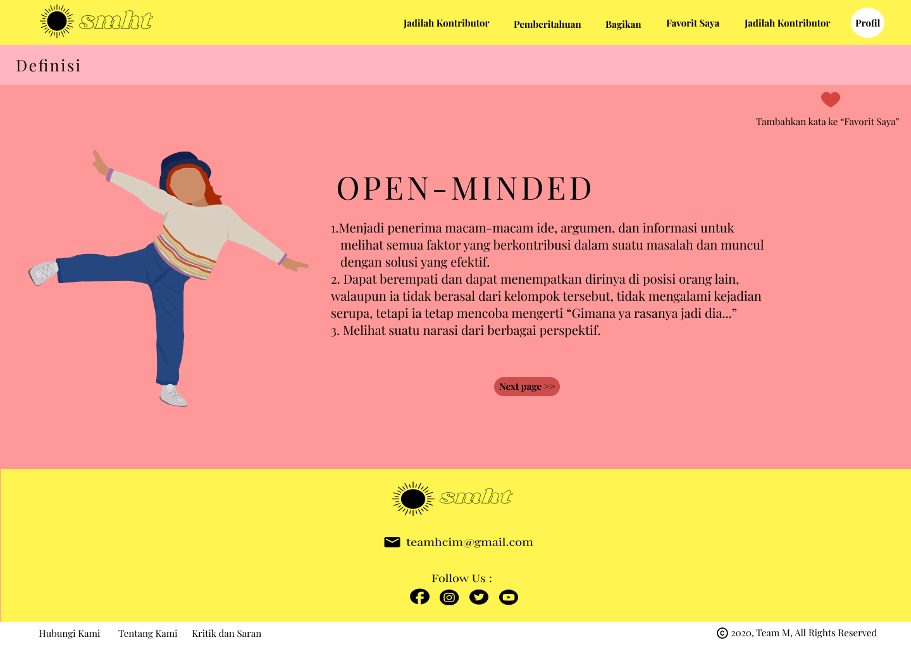

### 13. FITUR FAVORIT SAYA

### 14. FITUR SHARE

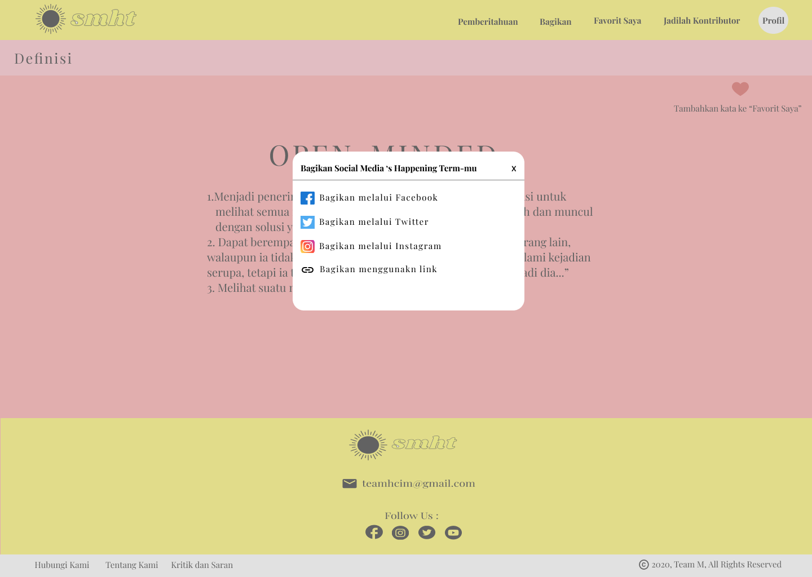

